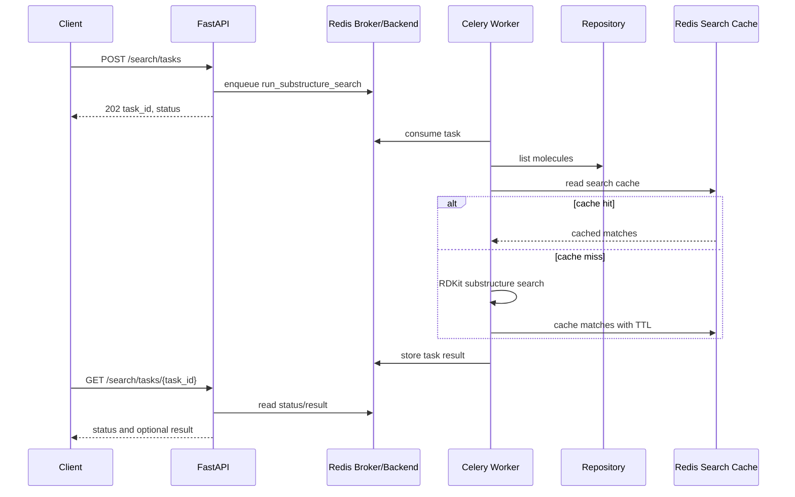
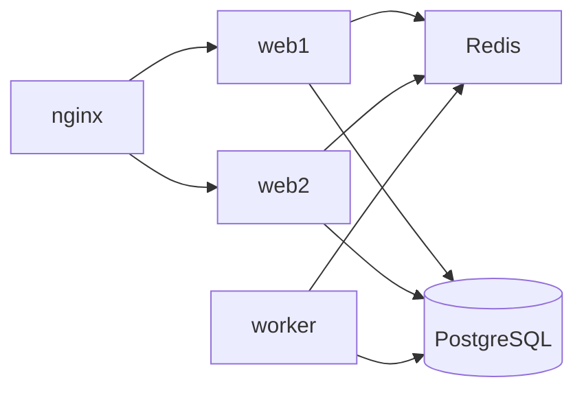

# Celery Async Search Component

Source: `Project.pdf`, `docs/requirements.md`, and the synchronous search implementation.

## Goal

Move long-running substructure search into an asynchronous workflow while keeping the existing synchronous endpoint available.

## Implemented Design

- Redis is used as Celery broker and result backend.
- Docker Compose runs a separate `worker` service.
- `POST /search/tasks` queues a search task and returns `task_id` plus task status.
- `GET /search/tasks/{task_id}` returns task status and includes the result after completion.
- Celery tasks reuse the same repository factory, RDKit search service, and Redis search cache as the API.
- Task lifecycle events are logged when tasks are queued, started, completed, and read.

## Async Flow

## Compose Topology

## API Contract

| Method | Path | Purpose |
|---|---|---|
| `POST` | `/search/tasks` | Queue an asynchronous search task |
| `GET` | `/search/tasks/{task_id}` | Read task status and result |
| `POST` | `/search` | Existing synchronous search shortcut |

## Verification

- API tests patch Celery objects to verify task creation and completed task responses without requiring a live broker.
- Manual verification: run `docker compose up --build`, call `POST /search/tasks`, then poll `GET /search/tasks/{task_id}` until status is `SUCCESS`.
