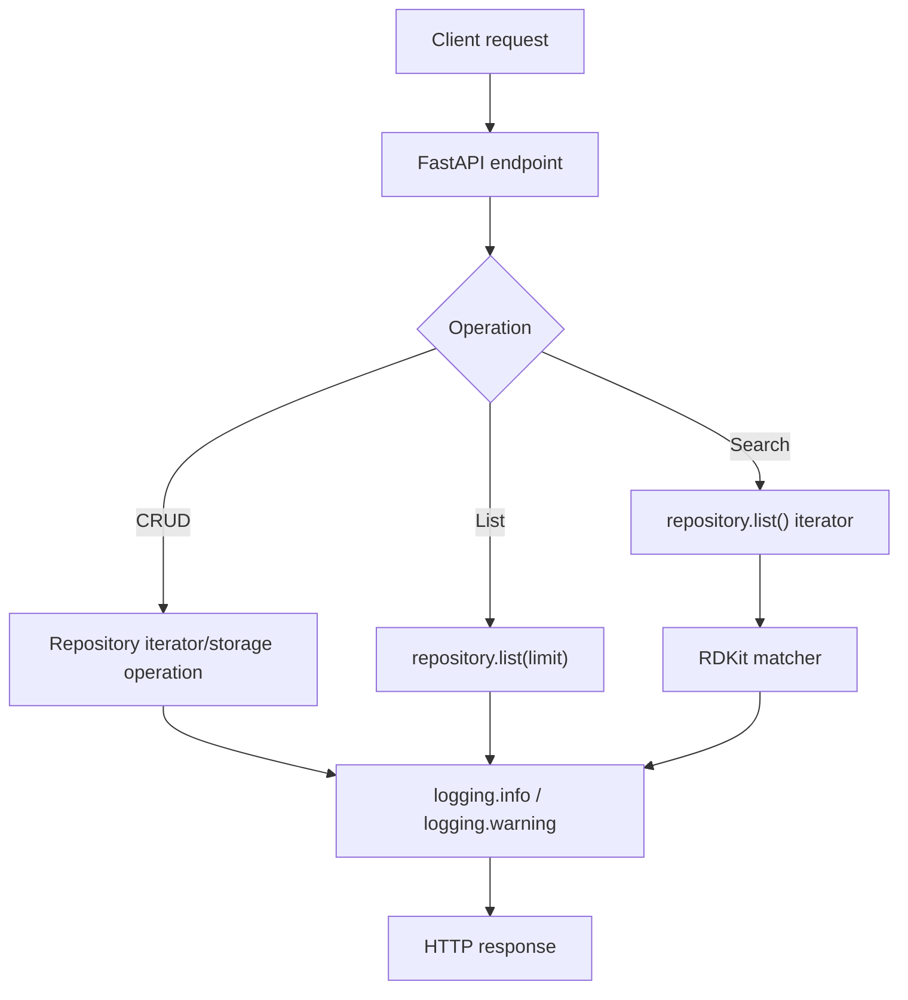

# Logging And Iterator Listing Component

Source: `Project.pdf`, `docs/requirements.md`, and the current API/repository code.

## Goal

Add standard-library logging for the main application activity and keep molecule listing iterator-friendly with a `limit` parameter.

## Implemented Design

- `app.logging_config.configure_logging()` configures the standard `logging` package.
- CRUD endpoints log successful create, read, update, delete, duplicate identifiers, and missing identifiers.
- Validation failures for molecule SMILES and substructure SMILES are logged as warnings.
- Search logs the number of molecules evaluated and the number of matches returned.
- `GET /molecules` keeps using the repository iterator and applies `limit` before materializing the API response.
- API tests cover `limit=0` and negative `limit` validation.

## Request Flow

## Log Events

| Area | Events |
|---|---|
| CRUD | create, read, update, delete, duplicate identifier, missing identifier |
| Validation | invalid molecule SMILES, invalid substructure SMILES |
| Listing | requested limit and result count |
| Search | molecule count and match count |

## Remaining Logging Expansion

Cache hit/miss and task lifecycle logging will be added with the Redis and Celery components, because those flows do not exist yet.
