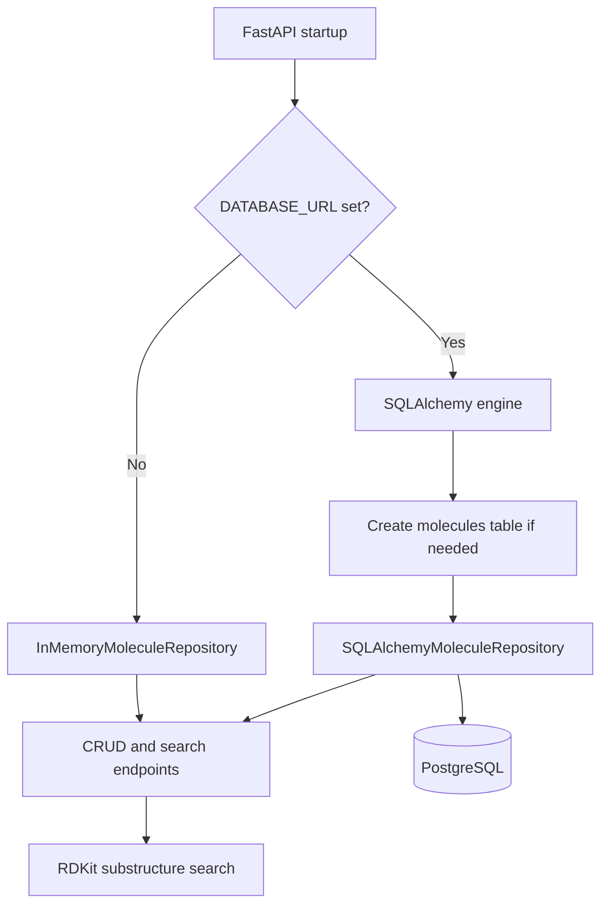
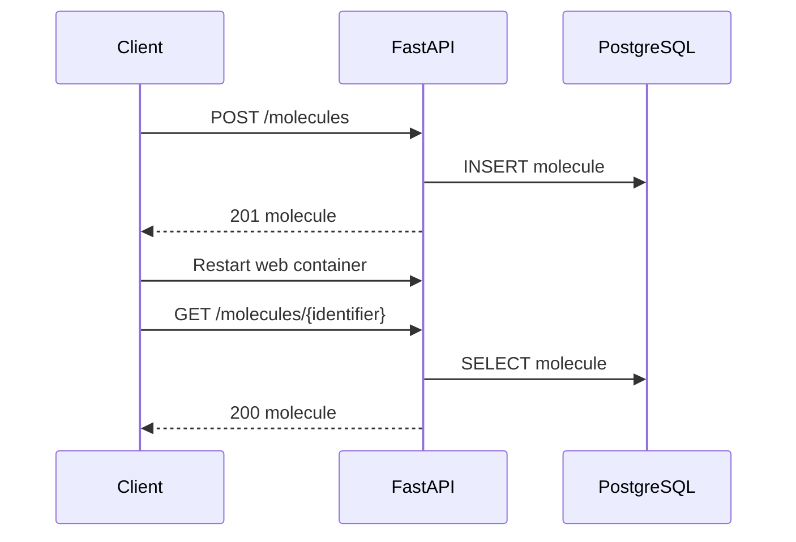

# PostgreSQL And SQLAlchemy Component

Source: `Project.pdf`, `docs/requirements.md`, and the current FastAPI/RAM implementation.

## Goal

Replace volatile RAM storage with persistent molecule storage while keeping the existing API contract unchanged.

## Implemented Design

- `DATABASE_URL` enables persistent storage.
- Without `DATABASE_URL`, the app keeps using `InMemoryMoleculeRepository`, which keeps local tests lightweight.
- With `DATABASE_URL`, the app creates a SQLAlchemy engine and uses `SQLAlchemyMoleculeRepository`.
- Docker Compose adds a `db` service based on PostgreSQL and stores credentials in `.env`.
- The `molecules` table stores `identifier` as the primary key and `smiles` as the molecule value.

## Runtime Flow

## Persistence Verification

## Manual Check

1. Copy `.env.example` to `.env`.
2. Run `docker compose up --build`.
3. Create a molecule through `POST /molecules`.
4. Restart `web1` or `web2`.
5. Read the same molecule through `GET /molecules/{identifier}`.
