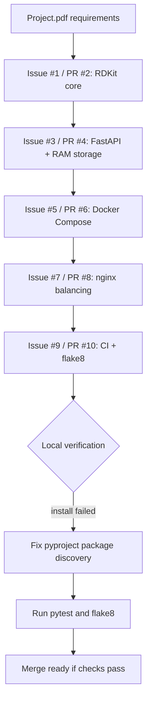
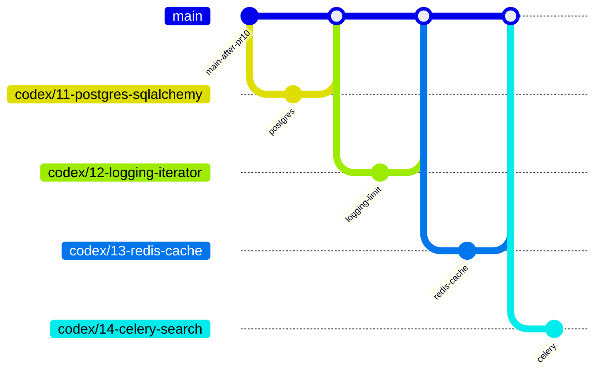

# Open PR And Issue Analysis

Source: `Project.pdf`, `docs/requirements.md`, open GitHub issues, and open GitHub pull requests in `origin`.

## Current Open Scope

| Issue | PR | Component | Assessment |
|---|---|---|---|
| #1 | #2 | RDKit search core | Satisfies the issue scope: project structure, RDKit parsing/matching, invalid substructure handling, skipped invalid molecules, and focused tests are present. |
| #3 | #4 | FastAPI CRUD with RAM storage | Satisfies the issue scope: CRUD endpoints, health endpoint, Pydantic schemas, in-memory repository, synchronous stored-molecule search, and API tests are present. |
| #5 | #6 | Docker Compose application setup | Satisfies the issue scope: `Dockerfile`, `.dockerignore`, Compose web service, Uvicorn startup, RDKit dependency installation path, and port `8000` exposure are present. |
| #7 | #8 | nginx load balancing | Satisfies the issue scope: two web services, nginx reverse proxy, upstream configuration, port `80`, `/server`, and verification documentation are present. |
| #9 | #10 | CI and flake8 | Required a fix before merge: editable install failed because setuptools discovered both `app` and `nginx` as top-level packages. Added explicit package discovery for `app*`. |

## Merge Readiness

## Remaining Project.pdf Requirements After The First Five PRs

The PDF-derived requirements still not covered by the currently open issue/PR set are:

| Component | Required Work |
|---|---|
| PostgreSQL + SQLAlchemy | Replace RAM storage with persistent database storage, add a `postgres` Compose service, use `.env` credentials, and keep molecules across restarts. |
| Logging + iterator listing | Add standard `logging` for CRUD, search, validation errors, cache, and task lifecycle events; keep listing iterator-friendly and enforce `limit`. |
| Redis search cache | Add Redis, cache search results with TTL, handle cache hit/miss, and prevent stale results after molecule changes. |
| Celery async search | Add Celery worker, use Redis broker/backend, start search tasks through one endpoint, and read task status/result through another endpoint. |
| Optional upload | Add file upload for molecule imports if time allows. |

## Recommended Next Branches

