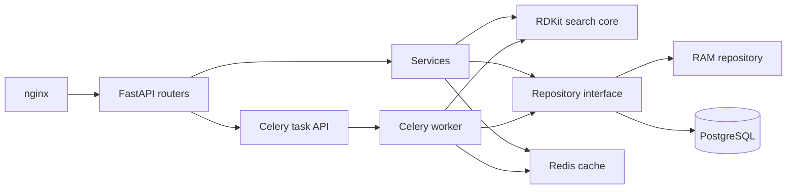
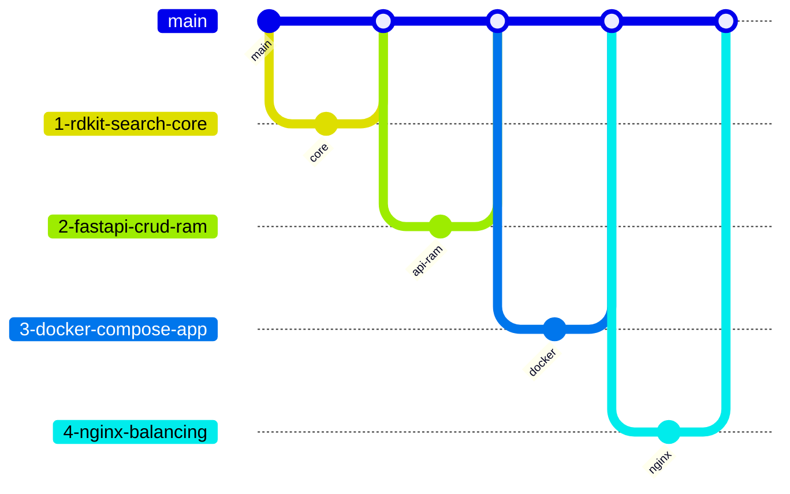

# Project Execution Plan

Goal: build a FastAPI substructure search service with RDKit, Docker, PostgreSQL, Redis caching, Celery, tests, and CI. Each major component is implemented in a separate issue branch and merged through a pull request.

## Branching Strategy

Integration branch: `main`.

Issue branches must use the format `<issue-number>-<short-name>`.

Planned component branches:

| Branch Example | Component | Result |
|---|---|---|
| `1-rdkit-search-core` | RDKit core | Project bootstrap, pure substructure search function, SMILES validation, unit tests |
| `<issue>-fastapi-crud-ram` | FastAPI + RAM storage | CRUD API, RAM-backed search endpoint, OpenAPI docs |
| `<issue>-docker-compose-app` | Docker | `Dockerfile`, `docker-compose.yml`, API container with RDKit |
| `<issue>-nginx-balancing` | nginx | Two web instances, nginx proxy, `server_id` endpoint |
| `<issue>-tests-ci-flake8` | Quality gate | pytest coverage for core/API, GitHub Actions, flake8 |
| `<issue>-postgres-sqlalchemy` | Database | PostgreSQL, SQLAlchemy repository, `.env` configuration |
| `<issue>-logging-iterator` | Logging + iterator | Structured logs, `limit` for molecule listing, iterator-based retrieval |
| `<issue>-redis-cache` | Redis cache | Search cache hit/miss, TTL, Redis in Compose |
| `<issue>-celery-search` | Celery async search | Search task endpoint, task status/result endpoint, worker in Compose |
| `<issue>-file-upload` | Optional upload | Molecule file upload if time permits |

## Architecture

## Implementation Milestones

### 1. Project Bootstrap And RDKit Search Core

- Create the Python package structure under `app/`.
- Split code into future-ready modules such as `core`, `api`, `schemas`, `services`, and `repositories` as they become necessary.
- Add minimal dependency and test configuration.
- Implement `substructure_search(molecules: list[str], substructure: str) -> list[str]`.
- Use `Chem.MolFromSmiles` and `HasSubstructMatch`.
- Define invalid input behavior:
  - invalid substructure raises a validation error;
  - invalid molecules in the input list are skipped so a batch search can still complete.
- Add tests for benzene, carboxylic acid, no matches, empty input, and invalid input.

Ready when: core unit tests pass and the project imports cleanly.

### 2. FastAPI CRUD With RAM Storage

- Add Pydantic models:
  - `MoleculeCreate`;
  - `MoleculeUpdate`;
  - `MoleculeRead`;
  - `SearchRequest`;
  - `SearchResponse`.
- Implement endpoints:
  - `POST /molecules`;
  - `GET /molecules/{identifier}`;
  - `PUT /molecules/{identifier}`;
  - `DELETE /molecules/{identifier}`;
  - `GET /molecules`;
  - `POST /search`;
  - `GET /health` or `/`.
- Use an in-memory repository for this stage.
- Return clear status codes: `201`, `200`, `204`, `400/422`, `404`, and `409`.

Ready when: CRUD and search are available through `/docs` and covered by tests.

### 3. Docker Compose For The Application

- Add `Dockerfile`.
- Add `.dockerignore`.
- Add `docker-compose.yml` with the web service.
- Ensure RDKit installs successfully inside the container.
- Expose port `8000`.

Ready when: `docker compose up --build` starts the API and `/docs` is reachable.

### 4. nginx Balancing

- Add `nginx/default.conf`.
- Run `web1`, `web2`, and `nginx` services in Compose.
- Add an endpoint that returns `server_id` from the environment.
- Configure nginx upstream across both web services.

Ready when: requests through nginx return both server IDs over repeated calls.

### 5. Tests, CI, And flake8

- Expand pytest coverage:
  - core tests;
  - API tests through FastAPI TestClient;
  - repository behavior;
  - negative cases.
- Add `flake8`.
- Add GitHub Actions workflow:
  - checkout;
  - setup Python;
  - install dependencies;
  - run flake8;
  - run pytest.

Ready when: CI passes after push.

### 6. PostgreSQL And SQLAlchemy

- Add a `db` service to Compose.
- Move credentials to `.env`.
- Add SQLAlchemy model `Molecule`.
- Implement a repository interface and SQLAlchemy repository.
- Switch the API services from RAM to PostgreSQL.
- Keep the RAM repository useful for unit tests.

Ready when: stored molecules survive a web container restart.

### 7. Logging And Iterator-Based Listing

- Configure standard `logging`.
- Add logs to CRUD, search, cache, and task flows.
- Add `limit` to `GET /molecules`.
- Implement repository/service listing as iterator-friendly retrieval.
- Validate edge cases for `limit`.

Ready when: listing respects `limit` and logs show key actions.

### 8. Redis Search Cache

- Add a Redis service to Compose.
- Implement a cache service.
- Include both the substructure and current dataset version in the search cache key, or invalidate search keys after CRUD changes.
- Add TTL.
- Return search results from Redis on cache hit.

Ready when: repeated identical searches are served from Redis until TTL expiry or dataset change.

### 9. Celery Async Search

- Add Celery dependencies.
- Configure Redis as broker/backend.
- Add a worker service to Compose.
- Change search API:
  - `POST /search/tasks` starts a task and returns `task_id`;
  - `GET /search/tasks/{task_id}` returns status and result;
  - synchronous `POST /search` may remain as a shortcut if it does not conflict with the assignment.
- Reuse the same services/repositories/cache inside Celery tasks.

Ready when: search runs asynchronously and status/result are available through a separate request.

### 10. Optional File Upload

- Pick a simple format: CSV or JSON.
- Add `POST /molecules/upload`.
- Validate rows and return an import report: added, skipped, and errors.

Ready when: uploading a file adds valid molecules to storage.

## Integration Order

## Initial API Contract

| Method | Path | Purpose |
|---|---|---|
| `GET` | `/health` | Health check |
| `GET` | `/server` | nginx balancing check through `server_id` |
| `POST` | `/molecules` | Create molecule |
| `GET` | `/molecules/{identifier}` | Get molecule |
| `PUT` | `/molecules/{identifier}` | Update molecule |
| `DELETE` | `/molecules/{identifier}` | Delete molecule |
| `GET` | `/molecules?limit=100` | List molecules with limit |
| `POST` | `/search` | Synchronous search before Celery |
| `POST` | `/search/tasks` | Start asynchronous search after Celery |
| `GET` | `/search/tasks/{task_id}` | Read task status/result |
| `POST` | `/molecules/upload` | Optional molecule file upload |

## Risks And Decisions

| Risk | Decision |
|---|---|
| RDKit installation can be fragile in containers | Verify the container build early and pin a working dependency set |
| Search cache can become stale after CRUD changes | Add a dataset version to cache keys or invalidate search keys on mutation |
| Celery worker can drift from API configuration | Use shared settings and the same Compose environment variables |
| PostgreSQL/Redis integration tests can be heavy | Keep core/API tests isolated, then add a smaller integration suite |
| nginx can hide failing web services | Add health endpoints and inspect container logs |

## Definition Of Done

- All mandatory homework requirements from the PDF are implemented.
- The application starts through Docker Compose.
- CRUD, search, Redis cache, and Celery workflows are documented in OpenAPI.
- PostgreSQL preserves molecules across restarts.
- nginx distributes requests between two web instances.
- pytest and flake8 pass locally and in GitHub Actions.
- Logs are useful enough to diagnose the main operations.
- `docs/` contains up-to-date English documentation.
