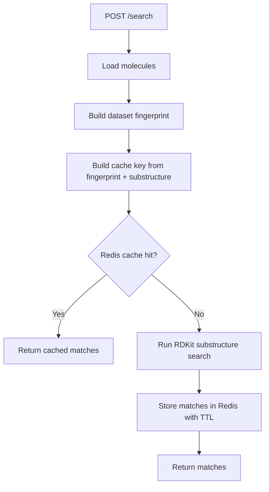
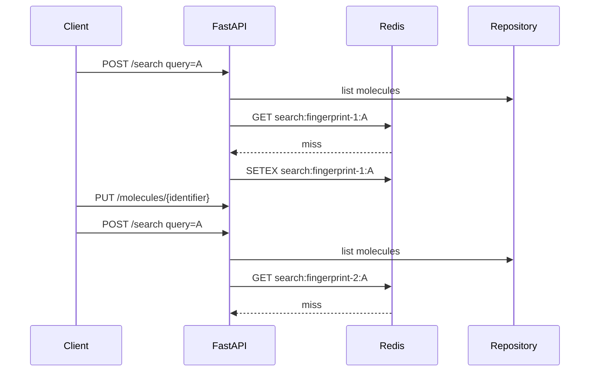

# Redis Search Cache Component

Source: `Project.pdf`, `docs/requirements.md`, and the current synchronous search endpoint.

## Goal

Cache repeated substructure search requests in Redis without returning stale results after molecule changes.

## Implemented Design

- `REDIS_URL` enables the search cache.
- `SEARCH_CACHE_TTL_SECONDS` controls the Redis TTL.
- If Redis is not configured, search remains synchronous and uncached.
- Cache keys include:
  - the requested substructure;
  - a SHA-256 fingerprint of the current molecule dataset.
- The dataset fingerprint is built from sorted molecule identifiers and SMILES strings.
- CRUD changes naturally produce a different search key because the molecule dataset fingerprint changes.
- Cache read/write failures are logged and do not prevent the search response.

## Search Flow

## Cache Key Freshness

## Verification

- Unit tests cover cache key stability, query changes, and dataset changes.
- Manual verification can be done by watching logs for `search cache miss` followed by `search cache hit` on repeated identical requests before TTL expiry.
