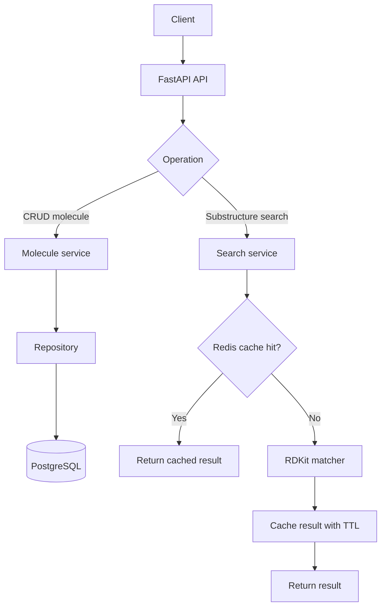
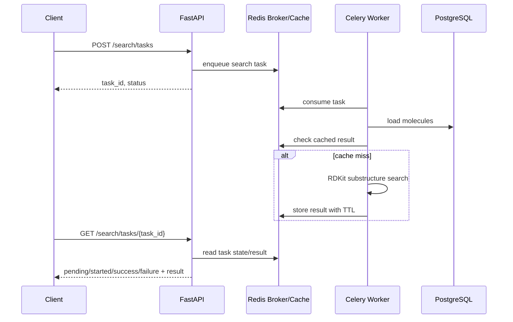

# Requirements Analysis From Project.pdf

Source: `Project.pdf`. The PDF was extracted automatically. Some code examples and dates are partially corrupted by embedded font encoding, so the requirements below are normalized from the readable homework sections.

## Project Goal

Build a substructure search service for chemical compounds. Users store molecules as SMILES strings, submit a substructure query, and receive all stored molecules that contain that substructure.

## Functional Requirements

1. Implement the RDKit substructure search core:
   - input 1: a list of molecules as SMILES strings;
   - input 2: a substructure as a SMILES string;
   - output: all molecules from the input list that contain the substructure;
   - use RDKit for molecule parsing and substructure matching;
   - the PDF example expects `c1ccccc1` to match benzene-containing molecules.

2. Implement a FastAPI server around the algorithm:
   - add a molecule by `identifier` and `smiles`;
   - get a molecule by `identifier`;
   - update a molecule by `identifier`;
   - delete a molecule by `identifier`;
   - list all molecules;
   - run substructure search across all added molecules;
   - optional: upload a file with molecules, with the file format chosen by the implementer.

3. Start with in-memory molecule storage:
   - standard data structures such as dictionaries are acceptable;
   - data is allowed to disappear after application restart during this stage.

4. Add Docker support:
   - provide a `Dockerfile` for the Python FastAPI application;
   - provide `docker-compose.yml`;
   - install `rdkit` in the application container;
   - run the app through Uvicorn on port `8000`.

5. Add nginx load balancing:
   - run at least two web application instances;
   - add nginx as a reverse proxy;
   - add an API method that returns `server_id` from the environment;
   - repeated requests through nginx should demonstrate traffic distribution between web containers.

6. Add tests for the riskiest part:
   - cover the substructure search function;
   - include positive and negative cases;
   - include empty input and invalid SMILES/substructure cases.

7. Add CI:
   - GitHub Actions must run tests after each push;
   - add static analysis with `flake8`.

8. Add PostgreSQL:
   - replace RAM storage with persistent molecule storage;
   - add a `postgres` service to Docker Compose;
   - keep credentials in `.env`;
   - use SQLAlchemy for database access.

9. Add logging:
   - use the standard `logging` package;
   - log key application activity: CRUD operations, search, validation errors, cache hit/miss, and task lifecycle events.

10. Add iterator-based listing with `limit`:
    - update the list-all-molecules API method;
    - add a `limit` argument;
    - return at most the requested number of molecules;
    - implement the retrieval path as an iterator-friendly flow.

11. Add Redis caching for search results:
    - integrate Redis through Docker Compose;
    - check Redis before running search;
    - return cached search results on cache hit;
    - on cache miss, run the search, cache the result, and return it;
    - cached search results must have a TTL;
    - tests or manual verification must show that repeated search requests use Redis.

12. Add Celery:
    - use Redis as broker/backend;
    - change the substructure search API to an asynchronous workflow;
    - one request starts a search task;
    - another request reads task status and returns the result when ready;
    - run the Celery worker as a separate Docker Compose service.

## Non-Functional Requirements

- The project must be reproducible through Docker Compose.
- The API should expose clear request/response models and standard HTTP status codes.
- Invalid SMILES, missing identifiers, and duplicate identifiers must be handled explicitly.
- Tests and `flake8` must pass in CI.
- Logs must make the main application activity understandable without `print`.
- After the PostgreSQL stage, molecules must survive web application restarts.
- Search cache keys must account for the query and the current molecule dataset state.

## Main Request Flow

## Async Search Flow After Celery

## PDF Notes

- The PDF includes a `Deadlines` section, but its dates and work numbers are partially corrupted during extraction. The readable content indicates a sequence of staged project submissions.
- All homework blocks from the PDF are covered here: RDKit, FastAPI, Docker, nginx, testing, CI, database, logging/iterator, Redis, and Celery.
